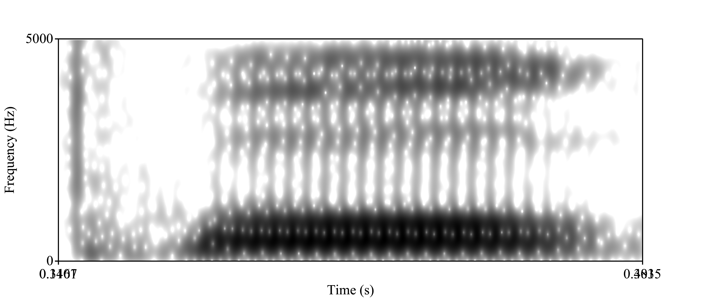
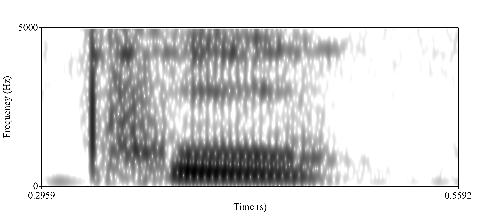

```{r setup, include=FALSE}
knitr::opts_chunk$set(echo = TRUE)
```

## Introducción/Hipótesis

***Propongo que los aprendices del español del estudio tendrán una desviación estándar y un rango más amplios de VOT que los hablantes de herencia en cuanto a su producción de las oclusivas / k p t / en español.***

Los motivos por esta hipótesis se centran en el contexto de adquisición.  Los hablantes de herencia adquieren su lengua natal con familiares, mientras los aprendices aprenden en aulas y a veces en lugares de contacto con la lengua meta.  Puesto que hay varias maneras de adquirir una segunda lengua, y no una natal (es decir, uno es un proceso consciente y otro no lo es), podría haber más varianza en el VOT debido al efecto diferencial de las experiencias individuales.


## Preparación
### Libraries
```{r, warning=FALSE, message=FALSE}
library(tidyverse)
library(knitr)
library(ggplot2)
library(dbplyr)
```

### Cargar datos
```{r load-data}
bi01 = read.csv("../data/bi01.csv")
bi02 = read.csv("../data/bi02.csv")
bi03 = read.csv("../data/bi03.csv")
ne01 = read.csv("../data/ne01.csv")
ne02 = read.csv("../data/ne02.csv")
ne03 = read.csv("../data/ne03.csv")
```

### Limpiar datos: crear lista agregada
```{r, combine-tables}
aggregate = bind_rows(bi01, bi02, bi03, ne01, ne02, ne03)
```

### Limpiar datos: limpiar datos agregados
```{r, improve-tables}
aggregate = separate(data = aggregate, col = fileID, into = c("ID", "palabra"), sep = "_")

aggregate = separate(data = aggregate, col = palabra, into = c("palabra", "repetición"), sep = "(?<=[A-Za-z])(?=[0-9])", extra = "drop", fill = "right")

aggregate = separate(data = aggregate, col = ID, into = c("grupo", "ID"), sep = "(?<=[A-Za-z])(?=[0-9])", extra = "drop", fill = "right")
```

## Visualización
### Ejemplo de VOT corto
```{r, import-short-VOT}

```

**Figura 1.** El espectorgrama que refleja un VOT corto de aproximadamente 8 milisegundos para el token *puku*, intento #1 del participante ne03.  Es sorprendente ver el espacio estrecho entre entre la barra de prefonación a aproximadamente 45 milisegundos y el comienzo de la fonación a aproximadamente 55 milisegundos, puesto que es un participante cuya lengua natal (inglés) tiene VOT más largo del español.

### Ejemplo de VOT largo
```{r, import-long-VOT}

```

**Figura 2.**  El espectrograma que refleja un VOT más largo de aproximadamente 30 milisegundos para el token *puku*, intento #1 del participante bi03.  Nótese el espacio largo entre la barra de prefonación a aproximadamente 25 milisegundos y el comienzo de la fonación a aproximadamente 55 milisegundos.  El espacio entre estos puntos es el VOT más largo, un resultado no esperado de este participante bilingüe.

## Prueba de estadísticas
```{r, descriptive-stats}
Tabla_VOT = aggregate %>%
  group_by(grupo, ID) %>%
  summarize(Promedio_VOT = mean(vot), DE_VOT = sd(vot), Rango_VOT = (max(vot)-min(vot)))

Tabla_VOT_resumido = aggregate %>%
  group_by(grupo) %>%
  summarise(Promedio_VOT = mean(vot), DE_VOT = sd(vot), Rango_VOT = (max(vot)-min(vot)))
```

```{r, create-kables}
kable(Tabla_VOT[1:5], caption = "**Tabla 1.** Las estadísticas descriptivas de VOT por participante, donde *bi* representa a los hablantes de herencia y *ne* representa a los aprendices del español.")

kable(Tabla_VOT_resumido[1:4], caption = "**Tabla 2.** Las estadísticas descriptivas de VOT por grupo de participante (valores promedios de los 3 participantes en cada grupo), donde *bi* representa a los hablantes de herencia y *ne* representa a los aprendices del español.")
```

## Gráficas
### Propiedades de VOT
```{r, plot-all-VOT}
aggregate %>%
  ggplot(., aes(x = grupo, y = vot, color = ID)) +
  geom_point()
```

**Figura 3.** Gráfica de los valores de VOT en milisegundos de cada participante organizado por grupo (*bi* = hablante de herencia; *ne* = aprendiz).

### Valores promedios de VOT
```{r, plot-average-VOT}
Tabla_VOT %>%
  ggplot(., aes(x = grupo, y = Promedio_VOT, color = ID)) +
  geom_point()
```

**Figura 4.**  Gráfica de los promedios de VOT de cada participante organizado por grupo (*bi* = hablantes de herencia; *ne* = aprendices).


## Conclusión
### Análisis de datos
La comparación de las desviaciones estándares y de los rangos de cada grupo de participantes rechaza la hipótesis propuesta.  No hay diferencia significativa entre el valor de VOT promedio de los participantes bilingües comparado con él de los aprendices.  Por lo tanto, la predicción de que habría una desviación estándar de VOT más amplia para el grupo de aprendices no se cumple.  Además, el rango de valores de VOT para los hablantes de herencia es mucho más amplio que él de los aprendices, un hallazgo que sugiere lo opuesto de la predicción, que hay más variabilidad en los hablantes de herencia del español en cuanto a sus valores de VOT que los aprendices.

### Preguntas generales
Por primera vez, empecé a ver la utilidad de *R* como software.  Creo que es una herramienta muy útil para el análisis de los datos, y por primera vez empecé a creer que sería posible llegar a entender cómo darle forma a mis análisis futuros usando esta tecnología.  De todo, diría que sacar el vector de PRAAT fue un rollo.  De todas maneras, me hubiese gustado saber más sobre los modelos estadísticos para que los pudiese incorporar en este proyecto y hacer una hipótesis algo más específica/técnica.  Al final, me gustó tener más libertad con esta tarea.  No la pude hacer totalmente independientemente, pero aprendí a manipular las funciones y los chunks para llegar a crear un proyecto más o menos coherente.

## Just for fun…Espacio vocálico
Se nota que los grupos (hablantes de herencia/aprendices del español) produjeron las vocales de manera significativamente distinta.  La siguiente gráfica ilustra los centroides (medida de F1 y F2 al punto medio de cada vocal) de cada estímulo divididos por grupo (hablantes de herencia/aprendices del español).
```{r, plot-vowel-space}
aggregate %>%
  ggplot(., aes(x = f2, y = f1, color = grupo)) + 
  geom_point() +
  scale_y_reverse() +
  scale_x_reverse()
```

**Figura 5.**  Los valores formánticos (F1/F2) de las vocales tónicas de los estímulos divididos por participante y grupo (color).